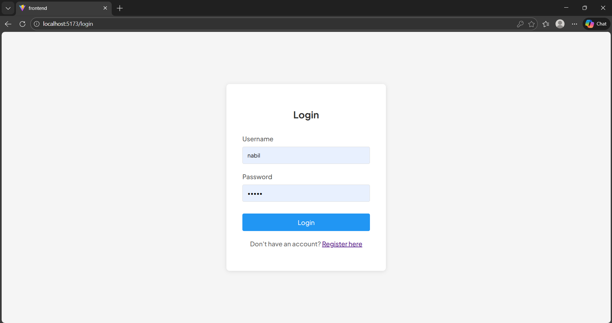
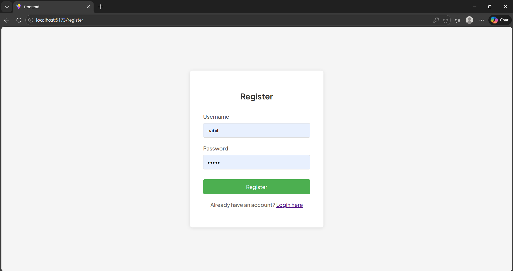
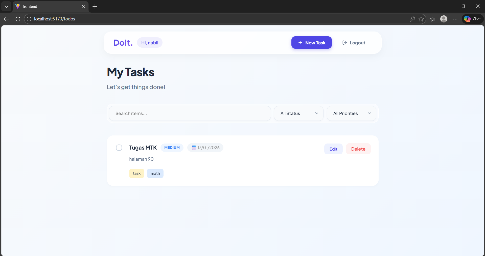
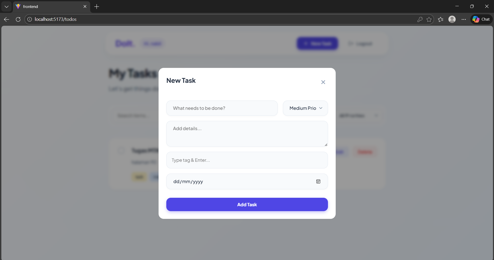

# Go-React Todo App 🇮🇩

Halo! Ini adalah aplikasi **Todo List Fullstack** sederhana tapi modern. Proyek ini dibuat untuk belajar bagaimana cara menggabungkan **Golang** (backend) dan **React** (frontend) menjadi satu aplikasi yang utuh.

Cocok banget buat kamu yang mau belajar bikin aplikasi Fullstack atau sekedar *kepo* sama Golang & React.

---

## 🚀 Teknologi yang Dipakai

Aplikasi ini dibangun menggunakan teknologi kekinian:

### Backend (Sisi Server)
- **Golang**: Bahasa pemrograman yang kencang dan *type-safe*.
- **Fiber v2**: Framework web buat Go yang mirip Express.js (cepat banget!).
- **GORM**: Library buat ngobrol sama database (ORM), jadi gak perlu tulis query SQL manual terus.
- **MySQL**: Databasenya.
- **JWT**: Untuk sistem login yang aman (biar gak sembarang orang bisa akses).

### Frontend (Sisi Tampilan)
- **React**: Library JavaScript paling populer buat bikin UI.
- **Vite**: *Build tool* pengganti CRA (Create React App) yang super ngebut.
- **Axios**: Buat "nembak" API ke backend.
- **CSS Custom**: Desainnya pakai gaya *Glassmorphism* (efek kaca) biar estetik ✨.

- **CSS Custom**: Desainnya pakai gaya *Glassmorphism* (efek kaca) biar estetik ✨.

---

## 📸 Screenshots

| Login Page | Register Page |
|:----------:|:-------------:|
|  |  |

| Dashboard (List) | New Task Modal |
|:----------------:|:--------------:|
|  |  |

---

## 🛠️ Persiapan (Wajib Install)

Sebelum mulai, pastikan di laptop kamu sudah terinstall "Tiga Serangkai" ini ya:

1.  **[Go (Golang)](https://go.dev/dl/)** (Minimal versi 1.20) - *Buat jalanin backendnya.*
2.  **[Node.js](https://nodejs.org/)** (Minimal versi 18) - *Buat jalanin frontendnya.*
3.  **[Docker Desktop](https://www.docker.com/products/docker-desktop/)** - *Buat jalanin database MySQL tanpa ribet install manual.*

---

## 🏃‍♂️ Cara Menjalankan (Step-by-Step)

Ikuti langkah-langkah ini, dijamin jalan!

### 1. Clone Project Ini
Pertama, download dulu kodingannya ke laptop kamu. Buka terminal/CMD/Git Bash:

```bash
git clone https://github.com/bilsinteta/todo-app
cd todo-app
```

### 2. Nyalakan Database (Paling Gampang Pakai Docker)
Kita pakai Docker biar nggak perlu setting MySQL manual. Pastikan Docker Desktop sudah jalan, lalu ketik:

```bash
docker-compose up -d
```
*Tunggu sebentar... Docker akan mendownload MySQL dan menjalankannya di background.*

### 3. Jalankan Backend (Golang)
Buka terminal baru, masuk ke folder backend:

```bash
cd backend
```

Bikin file rahasia `.env` dulu (ini isinya konfigurasi database & password).
**Cara cepat di Windows (PowerShell):**
```powershell
echo PORT=8080 > .env
echo DB_HOST=localhost >> .env
echo DB_PORT=3310 >> .env
echo DB_USER=todo_user >> .env
echo DB_PASSWORD=todo_password >> .env
echo DB_NAME=todo_db >> .env
echo JWT_SECRET="ganti_tulisan_ini_jadi_password_rahasia_kamu" >> .env
```
*(Atau kamu bisa bikin file baru bernama `.env` manual dan copy isinya)*

Terus, install library-nya dan jalankan servernya:
```bash
go mod tidy
go run main.go
```
🚀 Backend sekarang jalan di `http://localhost:8080`

### 4. Jalankan Frontend (React)
Buka terminal baru lagi (jangan matikan terminal backend), masuk ke folder frontend:

```bash
cd frontend
```

Install semua kebutuhan frontend:
```bash
npm install
```

Nyalakan web-nya:
```bash
npm run dev
```
✨ Frontend sekarang jalan di `http://localhost:5173`. Buka link itu di browser kamu!

---

## 📝 Fitur yang Bisa Dicoba

1.  **Register & Login**: Coba bikin akun baru, terus login. Kalau password salah, bakal ditolak.
2.  **Tambah Tugas**: Klik tombol "New Task" isi judul dan deskripsi.
3.  **Hapus / Selesai**: Centang tugas kalau sudah selesai, atau hapus kalau batal.
- **Responsive**: Coba buka di HP atau kecilkan browser, tampilannya tetap rapi (navbar pindah ke atas).

---

## ✅ Cara Tes Sesuai Requirement (Simple To-Do List)

Meskipun aplikasi ini menggunakan teknologi canggih, fitur utamanya tetap **Simple To-Do List** sesuai permintaan. Berikut cara tesnya:

### 1. Register User Baru
- Buka aplikasi di `http://localhost:5173`.
- Klik menu **"Register"** di pojok kanan atas (atau redirect otomatis).
- Masukkan username & password bebas (contoh: `user1` / `password1`).
- Klik **Register**. Akun berhasil dibuat!

### 2. Login
- Masukkan username & password yang baru dibuat.
- Klik **Login**.
- Anda akan masuk ke halaman utama (Dashboard).

### 3. Tambah & Kelola Tugas (CRUD)
- **Tambah**: Klik tombol **"New Task"**, isi judul (misal: "Beli Telur"), klik **Simpan**. Tugas muncul di list.
- **Selesai**: Klik **Checkbox** di sebelah kiri tugas. Tugas akan dicoret.
- **Hapus**: Klik ikon **Sampah** 🗑️. Konfirmasi delete di popup. Tugas hilang.

### 4. Isolasi Data (Penting!)
Fitur ini memastikan user A tidak bisa melihat data user B.
- Buka **Incognito Window** baru di browser.
- Register user baru dengan nama beda (contoh: `user2`).
- Login sebagai `user2`.
- **Cek List**: Tugas "Beli Telur" milik `user1` **TIDAK AKAN MUNCUL** disini.
- List `user2` bersih dan siap diisi tugasnya sendiri.

---

## 📂 Struktur Folder (Biar Gak Bingung)

```
todo-app/
├── backend/            # Dapur Backend (Golang)
│   ├── config/         # Settingan koneksi Database
│   ├── controllers/    # "Otak"-nya aplikasi (Logika login, tambah todo ada disini)
│   ├── models/         # Bentuk tabel database (Schema)
│   ├── routes/         # Daftar alamat API (misal: /login, /todos)
│   └── main.go         # Pintu masuk (Entry point) aplikasi
│
├── frontend/           # Muka Depan (React)
│   ├── src/
│   │   ├── components/ # Potongan UI (Tombol, Form, Navbar)
│   │   ├── pages/      # Halaman utama (Login & Dashboard)
│   │   └── index.css   # File styling (CSS)
│   └── package.json    # Daftar belanjaan library JS
│
└── docker-compose.yml  # Resep buat bikin container MySQL
```

---

Selamat mencoba! Kalau ada error, coba cek lagi apakah Docker sudah nyala atau port-nya bentrok. Happy Coding! 💻🔥
